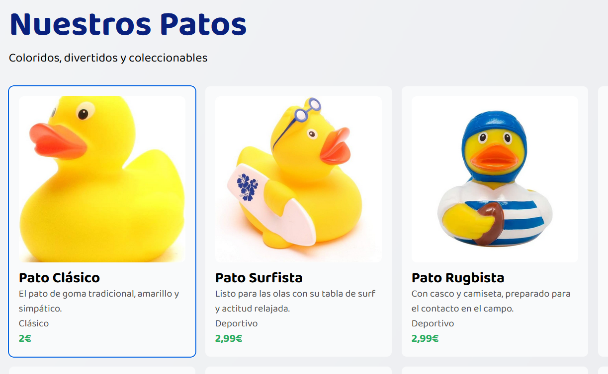
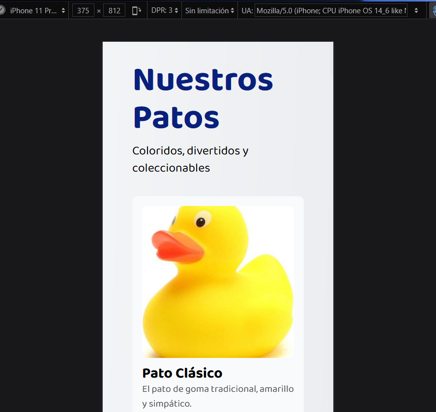
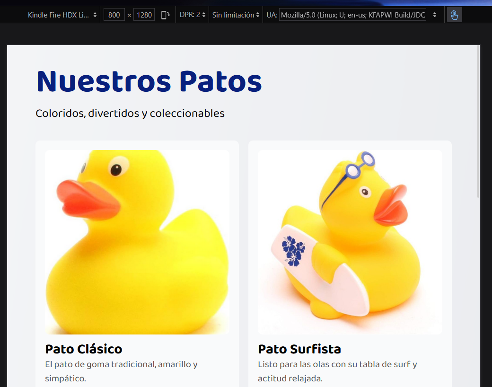
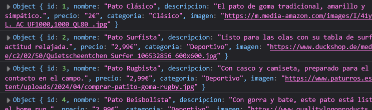

-------------------------------------------------------------------------

# Pruebas de usabilidad y accesibilidad 

## Tabulación

## Responsive

## Alt 

## Vista en diferentes pantallas

## Lector de pantalla

(He usado strong en el nombre del pato para dar enfasis)

## En ciertas partes del código se ha usado Anima para extraer el estilo de un texto

---
## Debe aparecer en la consola del navegador console.log(información)

