# URLs del Proyecto

## Render
https://apiproductos-vix4.onrender.com/productos 

## Vercel
https://patosreconocimientovoz.vercel.app/

## Repositorio del Proyecto
https://github.com/InterfacesVanesaSekeresh/patosreconocimientovoz

(API con patos de ejemplo): https://github.com/InterfacesVanesaSekeresh/ApiProductos

## Reflexión

### ¿Dónde está desplegada cada parte?

- La api está desplegada en Render.
- La web está en Vercel  
- La aplicación de escritorio está en Electron. 

### Problemas encontrados durante el despliegue

La web no se actualizaba al hacer push.
El proyecto estaba conectado a dos repositorios distintos. Yo actualizaba el repositorio de la organización, pero Vercel estaba vinculado a otro, así que la web no cambiaba. Para solucionarlo, vi que repositorio usaba Vercler y actualice ese. 

Al generar la aplicación de escritorio con Electron, se creó una carpeta dist-electron/ que contenía el ejecutable (.exe) y otros archivos. Al pesar más de lo que GitHub permite, me toco añadir dist-electron/ y *.exe en el .gitignore para que me hiciera el push.

## Qué diferencias existen entre web y escritorio:

### ¿Qué ventajas tiene el despliegue web frente al de escritorio?

- Funciona en cualquier dispositivo con navegador. 
- No hay que instalar nada.  
- Se actualiza automáticamente. 
- Es más ligero. 

### ¿Por qué Electron no sustituye a una web?

- Hay que instalarlo. 
- Pesa más.  
- No es accesible desde cualquier dispositivo. 
- No se actualiza automáticamente.

## Capturas de la aplicación de escritorio.

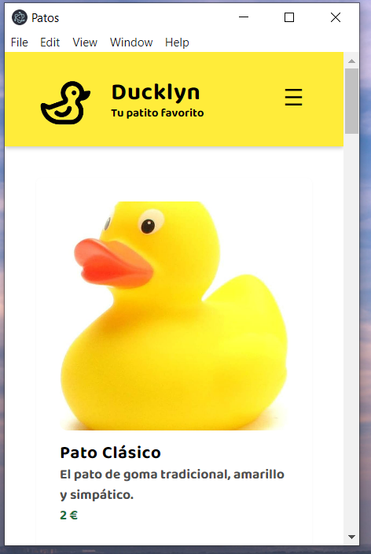

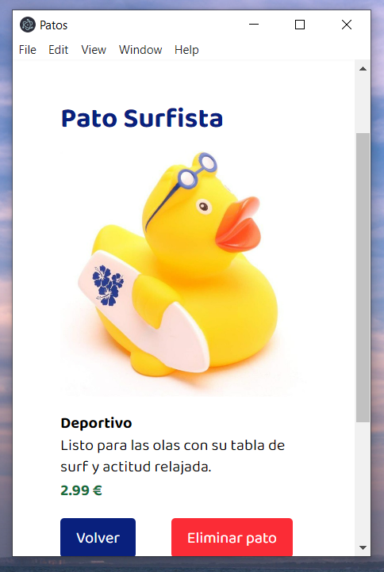

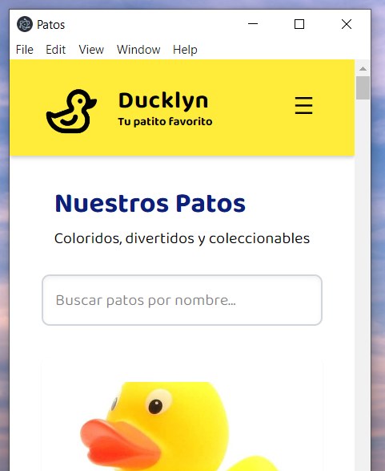

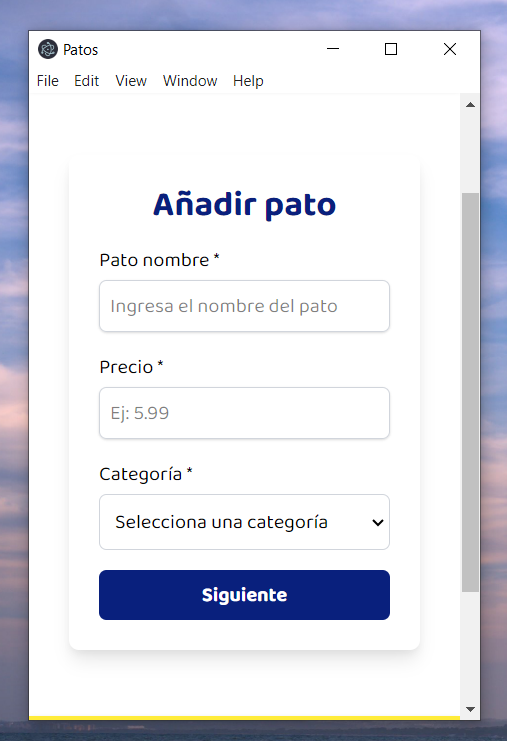

-------------------------------------------------------------------------

# Pruebas de usabilidad y accesibilidad 

## Tabulación

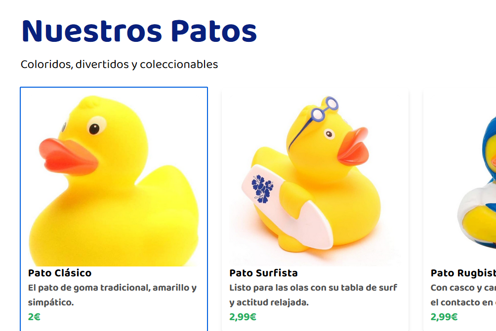

## Responsive

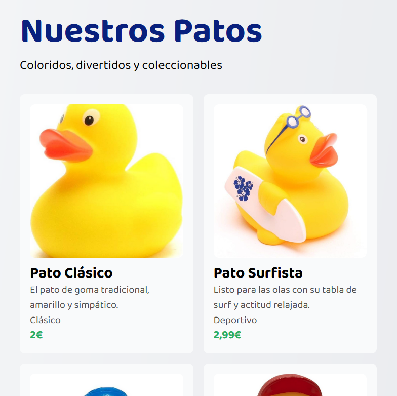

## Alt 

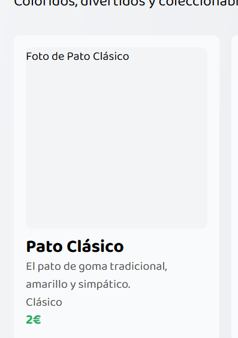

## Vista en diferentes pantallas

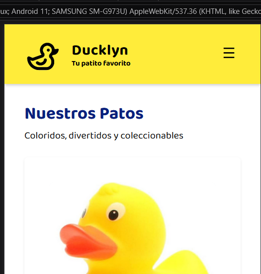

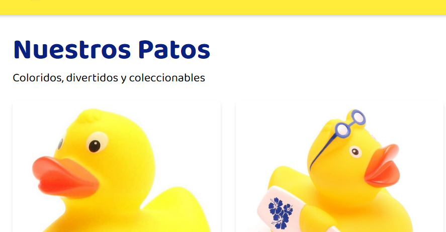

## Lector de pantalla

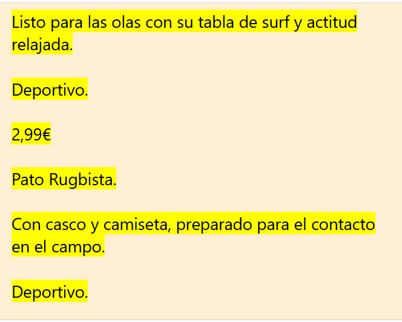
(He usado strong en el nombre del pato para dar enfasis)

## En ciertas partes del código se ha usado Anima para extraer el estilo de un texto

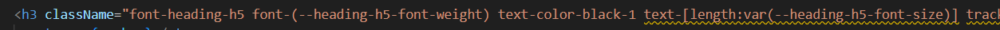

## "Carrusel" solo en pantallas grandes

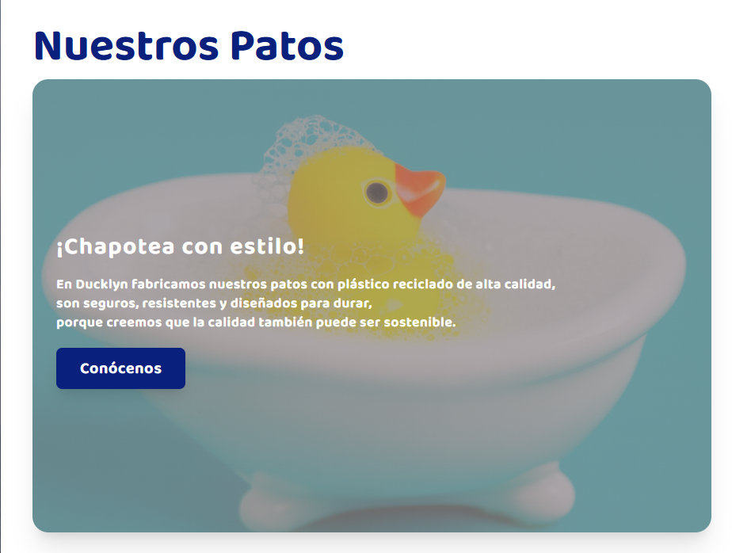

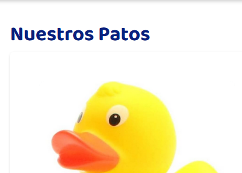

## Menú hamburguesa solo en móvil

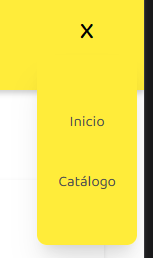

## Pie de página más sencillo en móvil

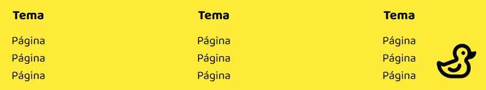

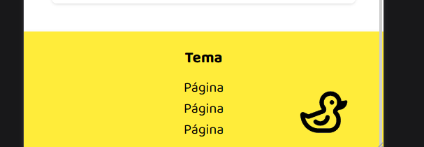

## El logo lleva al inicio de la página

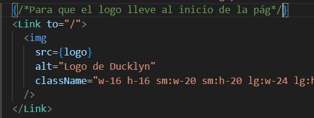

## Formulario partido en versión móvil

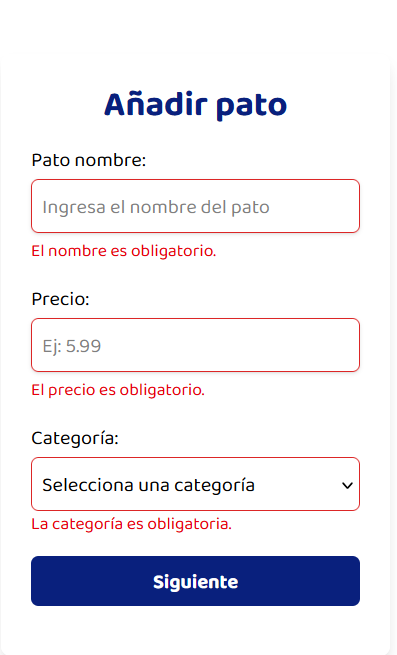

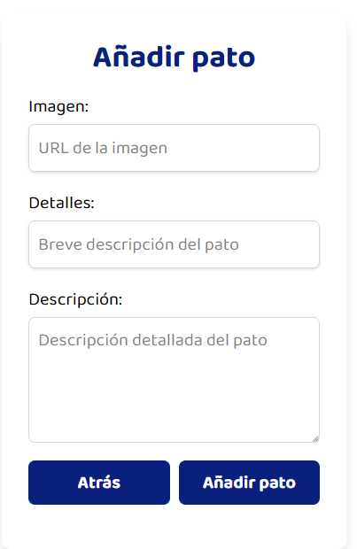

## Marcar los errores al insertar datos mal en el formulario + placeholder de ayuda

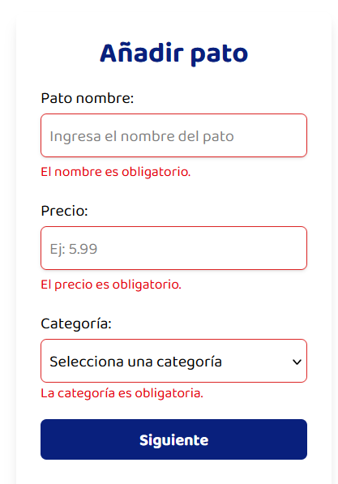